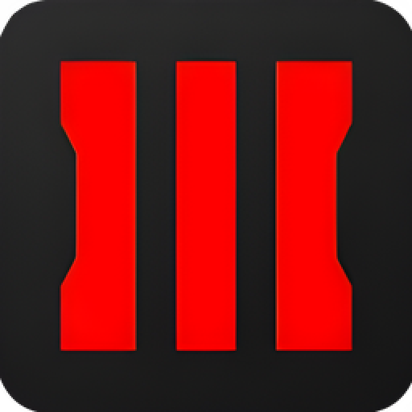
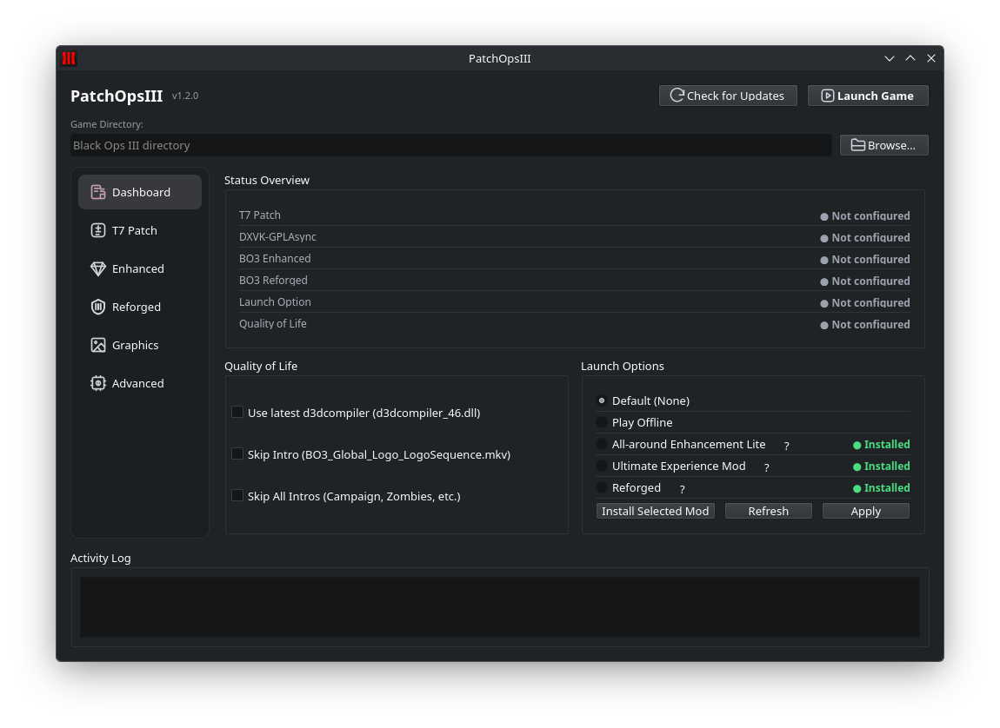

  

<h1 align="center">PatchOpsIII</h1>

  
  
  
  
  

  <strong>Pack-a-Punch your Black Ops III setup.</strong> 
  Your patches, mods, and settings. One app. More time slaying zombies.

  
  

  <a href="docs/README.md#installation">Install guide · Linux &amp; Steam Deck with Gear Lever</a>
  &nbsp;·&nbsp;
  <a href="https://github.com/boggedbrush/PatchOpsIII/releases">Browse releases</a>

### Gear up for the next round

| Stock your arsenal | Call the shots | Skip the busywork |
| --- | --- | --- |
| Install and configure **T7 Patch, BO3 Enhanced, and DXVK** from one place. | Switch **game executables** and choose your **Steam launch profile**. | Tune **graphics**, set **frame limits**, and **skip intros** with controls built right in. |

  <strong>The horde isn't waiting.</strong> 
  Download. Select your Black Ops III folder. Get back in the fight.

---

[Documentation](docs/README.md) · [Report a bug](https://github.com/boggedbrush/PatchOpsIII/issues/new?template=bug-report.yml) · [MIT License](LICENSE)
