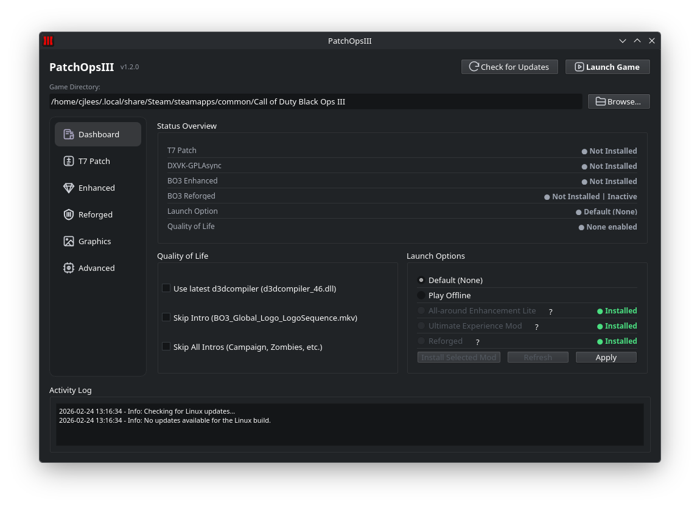

# PatchOpsIII v1.2.0 Release Notes

## Overview
PatchOpsIII v1.2.0 is a large feature release since v1.1.0, centered on BO3 Enhanced support, Reforged-first mod compatibility flows, and a major dashboard/UI overhaul. It also adds stronger integrity checks, safer uninstall behavior, and a one-click reset path back to stock.

---

## 🚀 Major Highlights
- New **BO3 Enhanced** tab with guided install/update/uninstall.
- New **BO3 Reforged** workflow with executable install/uninstall, integrity checks, and T7 settings support.
- Launch-option management updated for current BO3 compatibility constraints:
  - Workshop mod options are gated when unsupported.
  - `Default` and `Play Offline` remain available.
- New **Status Overview** dashboard and improved mod/QoL visibility.
- New **Reset to Stock** in Advanced to restore config, launch options, and managed files.

## 🖼 UI Preview

---

## 📝 Detailed Changes

### BO3 Enhanced
- Added `bo3_enhanced.py` service flow for:
  - latest release discovery from GitHub,
  - archive checksum caching (`bo3_enhanced_checksums.json`),
  - validated install (dump-first, enhanced-last),
  - backup-aware uninstall with protected executable fallback.
- Added guided dump source selection for `DUMP.zip`, dump folder, or `BlackOps3.exe` parent.
- Added strict dump/install safety constraints and rollback-friendly backup handling.
- Added Enhanced state tracking with warning and compatibility gating.

### Reforged + Launch Options
- Added Reforged executable install with SHA-256 trust validation and backup preservation.
- Added Reforged uninstall restore flow and launch-option cleanup safeguards.
- Added Reforged T7 settings editing (`players/T7.json`) including password visibility controls.
- Added workshop profile install/status integration in Launch Options:
  - one-click workshop open + apply,
  - per-profile install/subscription status indicators,
  - improved row layout (`?` help near mod name, right-aligned status).
- Added compatibility gating so workshop mod launch options are disabled when unsupported, while `Default` and `Play Offline` remain usable.

### Dashboard and UX
- Introduced a full **Status Overview** panel for T7, DXVK, Enhanced, Reforged, Launch Option, and QoL.
- Updated status semantics:
  - optional/not-installed components now show neutral gray instead of error red,
  - Reforged status tracks executable install and launch-option activation as separate states.
- Refined QoL summary logic to avoid duplicate implied items (e.g., `Skip All Intros` implies `Skip Intro`).
- Modernized main UI with sidebar navigation, updated spacing/layouts, and icon refresh.

### Graphics / DXVK / Advanced
- Reorganized Graphics and DXVK into nested tabs with aligned container sizing.
- Removed redundant internal tab titles to reduce visual duplication.
- Expanded Advanced tools:
  - Clear Logs
  - Copy Logs
  - Clear Mod Files
  - **Reset to Stock**
- Reset-to-Stock now runs asynchronously to avoid UI stalls and reduces log spam during bulk state updates.

---

## 🛠 Fixes

### Cross-Platform
- Improved uninstall resilience for Enhanced and Reforged workflows, including protected-file handling when backups are missing.
- Fixed state synchronization bugs where launch-option status could remain active after Reforged uninstall.
- Fixed launch-option gating edge cases to ensure unsupported mod profiles are blocked while safe defaults remain available.
- Fixed reset workflow responsiveness and excessive activity-log output during bulk reset operations.

### Windows
- Added stronger download and executable integrity checks for managed binaries.
- Improved Reforged download request compatibility and error handling.

### Linux and Steam Deck
- Preserved Linux launch-option compatibility handling while integrating new gating and workshop profile logic.

---

## ⚠️ Known Issues

- **BO3 Enhanced requires a manual game dump**
  - Impact: PatchOpsIII cannot download game dumps automatically; you must provide a valid UWP dump source.
  - Workaround: Use the in-app dump dialog and follow the linked guide to obtain a dump, then select `DUMP.zip` or the dump folder.
  - Status: Expected behavior (legal/safety constraint).

- **All-around Enhancement Mod**
  - Impact: The current All-around Enhancement Mod does not work correctly when launch options are used; the Lite version remains compatible.
  - Workaround: Use the Lite version of the All-around Enhancement Mod when launch options are configured.
  - Status: Fix under investigation.

- **Launch Options Stability on Linux and Steam Deck**
  - Impact: Launch options may not work consistently across all Linux distributions and Steam Deck setups.
  - Workaround: If issues occur, temporarily remove custom launch options and re-apply them incrementally.
  - Status: Behavior is being evaluated across additional distributions and Steam Deck configurations.

---

## 📥 Downloads & Verification

- **Windows**
  - Download: [PatchOpsIII v1.2.0 for Windows]({{WINDOWS_DOWNLOAD_URL}})
  - SHA256: `{{WINDOWS_SHA256}}`
  - VirusTotal: [Latest Windows Scan]({{WINDOWS_VT_URL}})

- **Linux & Steam Deck**
  - Download: [PatchOpsIII v1.2.0 for Linux & Steam Deck]({{LINUX_DOWNLOAD_URL}})
  - SHA256: `{{LINUX_SHA256}}`
  - VirusTotal: [Latest Linux Scan]({{LINUX_VT_URL}})

---

## 🧑‍💻 Acknowledgements
PatchOpsIII builds on the work of the following projects:
- **t7patch:** [t7patch on GitHub](https://github.com/shiversoftdev/t7patch)
- **dxvk-gplasync:** [dxvk-gplasync on GitLab](https://gitlab.com/Ph42oN/dxvk-gplasync)
- **ValvePython/vdf:** [ValvePython/vdf on GitHub](https://github.com/ValvePython/vdf)
- **BO3 Enhanced:** [BO3 Enhanced on GitHub](https://github.com/shiversoftdev/BO3Enhanced)
- **BO3 Reforged:** [BO3 Reforged](https://bo3reforged.com/)

---

## 🔮 Upcoming Work
- Additional validation and preflight checks around dump/game-directory edge cases.
- Expanded compatibility smoke tests for future release cadence.
- Continued bug fixes and performance optimizations based on user feedback.

---

If you encounter issues or have suggestions, please open an issue on the repository or share feedback with the community so we can prioritize future improvements.
