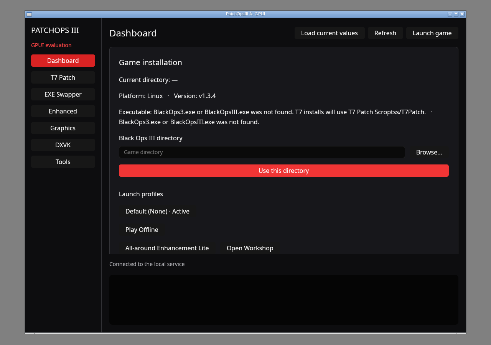

# Native GPUI architecture and migration record

Research date: 2026-10-02. Original baseline: the Electron/React/Python app,
which now remains as the legacy fallback.
Related alternatives: [Tauri shell + Rust core PR #36](https://github.com/boggedbrush/PatchOpsIII/pull/36)
and [in-process Rust/Tauri PR #40](https://github.com/boggedbrush/PatchOpsIII/pull/40).
The GPUI implementation started from `main`, independently of both Tauri branches,
and has since been selected as PatchOpsIII's primary desktop client.

## Findings and architecture decision

GPUI is Zed's GPU-accelerated Rust framework, combining retained entity state
with declarative view rendering. It is pre-1.0 and APIs can break between
versions. It replaces the renderer as well as the desktop shell: our React,
CSS, browser accessibility, DOM tests, and Electron IPC cannot simply transfer.
The upstream main README now describes a separate `gpui_platform` package;
the published GPUI 0.2.2 selected here still uses `Application::new()` and
includes the platform implementations. Mixing these APIs would break builds.

GPUI Component supplies keyboard-aware buttons and text inputs, text editing,
focus handling, and the root/theme setup, reducing custom control work. Pinning
the compatible GPUI 0.2.2 / Component 0.5.0 pair and committing the lockfile
avoids adopting an evolving Git revision or silently upgrading the toolkit.
The optional WebView feature is not enabled. Both dependencies use Apache-2.0;
distribution still needs an audit of notices for the complete dependency tree.

The original GPUI baseline reused Python to compare desktop renderers. The
native client now imports PR #40's Rust operations into `native/core`, a library
with no Tauri/webview dependency. GPUI and operations run in one Rust process;
legacy Electron retains its existing Python service. There is no local HTTP
server or Python supervision in the native binary or its archives.

The core retains verified downloads, ownership manifests, transactional backup
and rollback logic, Steam/VDF handling, and platform launch helpers from PR #40.
UI, hardware, accessibility and installer/updater validation remain separate
from this backend migration. No comparative performance improvement is claimed.

Sources inspected:

- [GPUI upstream README](https://github.com/zed-industries/zed/blob/main/crates/gpui/README.md): architecture, pre-1.0 status, platform requirements.
- [Published GPUI 0.2.2 source](https://crates.io/crates/gpui/0.2.2): standalone application, async contexts, platform folder prompts.
- [GPUI Component 0.5.0 source](https://crates.io/crates/gpui-component/0.5.0): compatible GPUI dependency, inputs, buttons, Root and theme setup.
- Repository `src/main/main.ts`, `src/renderer/lib/api.ts`, `src/renderer/main.tsx`, and `backend/api.py`: actual lifecycle, payloads, config normalization, state, error responses, and logs.
- PR #36 and #40 metadata: the shell-only migration and the subsequent backend rewrite have different scopes and costs.

## Implemented architecture

`native/` is a Cargo workspace with `patchops-core` and `patchopsiii-gpui`, a
committed workspace lockfile, and Rust 1.99.0. GPUI/Component stay pinned to
0.2.2/0.5.0. Presets and package.json version are embedded at build time, so
stable/beta release preparation applies to both Electron and GPUI.

`Backend::start()` creates a `patchops-gpui-core` worker. Public `requests:
Sender<Request>` and `replies: Receiver<Reply>` retain the existing UI contract.
`Request { path: String, body: Option<serde_json::Value> }` uses the existing
`/api/...` identifiers without making HTTP requests. `Reply { state:
Option<Value>, message: String, failed: bool, is_status: bool }` retains status,
operation messages, and the Steam depot command marker used by the UI.
Long operations and status assembly run sequentially on the worker; neither
blocks the UI thread. Closing a window does not cancel or join active operations.

`patchops_core::Engine::dispatch(path, body)` returns the same status keys and
`{ok, state}`, `{ok, error}`, validation, update and depot response envelopes as
the Python API. The Python flag is `ok`, rather than `success`. Internal Rust
errors become failed operation results/replies. Built-in launch profiles omit
`path`; Workshop profiles include it. The UI uses its native folder picker, so
Python's `/api/browse` endpoint is intentionally not implemented.

Update metadata retains `available`, `channel`, `currentVersion`,
`latestVersion`, `name`, `body`, `pageUrl`, and `asset {name, url, size,
contentType}`. Asset selection now chooses `PatchOpsIII-native-{linux,windows}-x64.zip`;
it does not point the GPUI user to legacy installers. Checks do not install an
update automatically. Draft and stable/prerelease checks are preserved.

Status hashing is cached by executable path, file size and modification time,
including preserved EXE availability probes. The bounded cache is display-only:
mutation validation always rereads bytes, verifies staging, and checks the active
target after replacement. Files without modification times are not cache hits.

### Progress and log hook

PR #40 emits `patchops-log` entries. `AppState::new(data_dir, resource_dir,
on_log)` replaces its AppHandle with an optional `EventCallback = Arc<dyn
Fn(LogEntry) + Send + Sync + 'static>`. `resource_dir: Option<PathBuf>` replaces
the Steam module's Tauri resource-path lookup. `set_progress_callback` adds
`ProgressCallback = Arc<dyn Fn(OperationProgress) + Send + Sync + 'static>`.
Callbacks run on the worker and must forward data to the UI thread.

The GPUI bridge exposes `events: Receiver<BackendEvent>`, with:

```rust
pub enum BackendEvent {
    Log(patchops_core::models::LogEntry), // category, message, line: String
    Progress(OperationProgress),
}
pub struct OperationProgress {
    pub op: String,                  // full request path, e.g. /api/t7-install
    pub stage: String,               // started/running/download/verify/completed/failed
    pub fraction: Option<f32>,       // stage-local [0,1], None = indeterminate
    pub message: String,
}
```

`OperationProgress` is re-exported from `backend`; it also derives Serialize and
Deserialize in core. Logs stream as they occur. Operations emit started and
terminal events; downloads emit throttled byte fractions when Content-Length is
known and SHA-256 verification stages. Status/depot polls emit no operation
progress. The UI agent's `on_progress(ProgressEvent, cx)` can map `op` through
`Operation::from_path`, forward Log entries, and map stages/fractions; wiring
that receiver belongs to the UI integration. Existing `send(path, body)` call
sites need no changes. Errors and validation failures are still failed replies;
compatible-depot failures retain `Steam console command: ...` in their message.

### Main-branch changes reconciled

- `aadb32d` (#43): September 10, 2026 BuildID 24784313 and SHA-256 are recognized;
  T7 uses the current profile. Unit tests cover the constants and hash classification.
- `20e1dbe` (#46), `ca9af04` (#47): prefer exact/versioned T7 release archives,
  then unambiguous platform/universal renamed packages with GitHub SHA-256
  digests. Tests cover discovery and ambiguity; unsigned candidates are rejected.
- `8888db6` (#50), `2503485` (#51): Electron AppImage tooling, SquashFS directory
  permissions, Firejail validation, UI compact layout, and update metadata do
  not apply to native ZIP archives. Their legacy workflows remain untouched.
- `c582a62`, `58f7ba3` and versions from #50/#51: package.json is the embedded
  runtime release version; no duplicate hard-coded desktop version is introduced.

Core keeps PR #40's archive/path validation and ownership rules. The Linux
Python-oracle suite now passes all 31 cases without ignored adapters. Config
writes normalize CRLF to LF, use Python's 0400/0600 read-only modes, and retain
permission error/log text. Steam launch-option applies use a permission-preserving
rolling backup on every apply, including no-ops, and no extra localconfig sibling
backup. Unrelated VDF operations retain their existing recovery policy.

DXVK settings adopt Python-era root DLL/config installs only when the DLL pair
matches one verified official release; the adoption manifest records real hashes
and preserves the original config. Unknown/foreign DLLs are refused. The parity
suite allows only the exact manifest, config backup, and their directories.
Enhanced first-read status binds matching legacy file records in memory per
AppState and preserves counts/timestamps without rewriting legacy JSON or
claiming destructive ownership. Durable status binding would require a separate
review of its filesystem difference. Verified archive adoption is still required
before installation/cleanup. See `native/core/tests/parity/README.md` for exact
rules, the narrow DXVK allowlist, and test seam limits.

Native archives contain the Rust binary, resources and docs only. The optional
Python scripts use the standard library as build/package/smoke helpers. Native CI
runs core and GPUI tests, formatting, Clippy, archive checks and a fake-game
window/status smoke. Stable/beta workflows retain native artifact names.

## Stack comparison

| Criterion | Legacy Electron | Tauri #36 / #40 | Primary GPUI client |
|---|---|---|---|
| UI technology | React/CSS + Chromium | React/CSS + OS WebView | Native Rust controls + GPU rendering |
| Backend | Python child + HTTP/WS | #36 Python + small Rust core; #40 in-process Rust | In-process patchops-core + worker channels |
| Renderer reuse | Baseline | High | Rewrite required |
| Platform work | Existing Windows/Linux packages | WebView availability and new Rust packaging | GPU/driver compatibility, native UI/input and new packaging |
| Accessibility | Browser infrastructure; app still needs testing | WebView infrastructure; app still needs testing | Must validate controls and screen readers on target OSes |
| Delivery | Existing MSI/NSIS/AppImage fallback | Independent open PRs | Self-contained Windows/Linux ZIPs with one Rust executable |
| Startup/RAM/package size | Measure | Measure each PR separately | Measure complete stack; no claimed improvement |
| Migration cost | Existing maintenance | Shell changes; #40 also ports operations | UI rewrite plus shared Rust operations |

## Workflow coverage

| Workflow | Native implementation | Remaining parity work |
|---|---|---|
| Installation detection/directory | Actual status and native folder picker; manual path entry; existing backend validation | Folder picker on Windows, Wayland portals and Steam Deck |
| Launch/profiles | Steam launch, backend-provided profiles, Workshop open/install request | Workshop progress presentation and detailed profile states |
| T7 Patch | Install/update, uninstall, gamertag/color/password, friends-only | Real install/UAC cancellation, name preview, password editing UX |
| EXE Swapper | Compatible/current/Enhanced restore, hash and integrity state, depot error text | Guided depot dialog/polling/copy action; real restore/backup checks |
| Enhanced | Pick/enter source, validate, install, uninstall | Real Windows/Linux game/proton workflows |
| Graphics | Presets, FPS, FOV, refresh, render %, resolution, display modes, V-Sync and FPS counter | Slider UX, valid hardware-specific mode list, side-by-side visual polish |
| Advanced/QoL | Smoothing, hidden options, CPU reduction, frame latency, VRAM target, intro/compiler/read-only toggles | Real config/backup verification on disposable installs |
| DXVK | Install/uninstall, async/cache/HUD, threads, FPS, latency and tear-free settings | Real download/install/proton behavior |
| Logs/maintenance | Up to 80 recent lines, five-second refresh, clear logs/cache, reset stock, update check/channel | Streaming WS logs, copy/export UX and platform updater integration |
| Delivery | Windows/Linux CI and self-contained release archives | Signed native installers, updater, dependency notices and broader release testing |

Status refresh polls the worker every five seconds. Executable hashes are reused
while size/mtime remain unchanged. Other status work (Steam config, mod state and
small config files) still runs on each poll; measure its idle CPU cost. All
game-modifying validation must use disposable installations and inspect backups.

## Measurement protocol retained from the selection process

Use the same Windows PC and Steam Deck/Linux PC for all three candidates. Record
OS, GPU/driver, display scale, power profile, game-directory state, and commit
SHA. Build optimized release artifacts. Exclude compilation, debugger and dev
servers. Compare Electron, #36, #40 and GPUI separately; the original Python-backed GPUI baseline and the current Rust-backed client
must be measured separately.

For regression tracking and any future comparison, collect ten cold launches and
ten warm launches per candidate. Record
process start to first painted interactive window **and** first loaded status
with screen recording or platform tracing. Include backend startup. Report
median and p95, retaining raw observations. Do not label cargo build time as app
startup time, or GPUI entity creation as first paint.

Measure idle for 60 seconds after settling, then the same navigation/config and
log workload. Use the native executable PID (Electron still has a process tree):

```sh
python -m pip install psutil
python scripts/measure_desktop.py --pid 12345 --label gpui-release \
  --seconds 60 --artifact dist/native/PatchOpsIII-native-linux-x64.zip \
  --output measurements/gpui-idle.json
```

The sampler captures RSS and CPU for the process tree, including children; RSS
can double-count shared pages and excludes GPU memory. Collect GPU usage with
platform tools. Measure the complete extracted native deliverable. Elevated/detached children must be measured
separately. Evaluate input latency, scrolling, text entry/IME, scaling, keyboard
focus, screen readers, offline/error behavior, and update/install/uninstall
reliability when comparing future changes. GPUI is the selected product client;
that decision does not substitute for collecting hardware measurements.

## Historical baseline validation and current gates

The following results describe the original Python-backed baseline, before the
in-process backend migration; they are not current Rust-core parity evidence.
On the supplied Linux cloud environment:

- Debug and optimized release builds completed with the locked dependency tree.
- Four Rust protocol tests passed, including an actual local HTTP worker request
  and HTTP error response. Clippy with warnings denied and rustfmt checks passed.
- Eight Python launcher/packaging tests pass, covering child reaping, startup/UI
  failures, missing binaries, early service exit, custom target-directory
  consistency, required bundle inputs, and the self-contained archive layout.
- The existing Electron renderer TypeScript check (`tsc --noEmit`) passed.
- A real Python service bound an ephemeral port, returned health/status with no
  game installation, and stopped accepting connections after launcher cleanup.
- The native window rendered under Xvfb/Openbox with Mesa's software Vulkan
  driver and an X compositor. Dashboard/Graphics navigation and text entry were
  inspected; an edited FPS draft remained unchanged across status refreshes.
- The normal X11 close path exposed a GPUI 0.2.2 callback borrow panic. Quit is
  now scheduled on a later event-loop turn. A read-only native lifecycle smoke
  check exercises the real platform close callback, and Linux CI runs it too.
- The original archive contents and process-tree sampler were smoke checked. The sampler
  captured the supervisor, Python API and native GUI; its debug/software-rendered
  samples are not comparative performance evidence.



A GUI Apply-click smoke check was rejected by automatic approval review because
it could activate a configuration/file-changing action. No game-mutating UI
clicks were executed. Confirmation behavior was reviewed in code; actual game
operations, Windows, Wayland, Steam Deck, accessibility, and comparative
performance remain manual/hardware validation gates. Native Windows/Linux CI
is configured in this PR; its hosted results are separate from these local checks.

## Reviewer smoke checklist

- Build with the pinned lockfile; open the native window on Windows and Linux.
- Start Electron simultaneously; confirm GPUI has no Python child or HTTP
  listener. Close GPUI while idle and confirm Electron stays alive.
- With no game directory, verify status/errors and manual folder input. Browse
  to a disposable BO3 install, confirm selection, refresh, and relaunch.
- Navigate every section with mouse and keyboard. Edit a field while refresh
  runs; confirm the draft remains. Verify current-values reload is explicit.
- Cancel an operation confirmation and verify no files changed. Verify the
  selected operation and target before confirming a config mutation.
- Apply a preset and individual config values; inspect config.ini and backend
  logs, including readonly error handling and special CPU/hidden-option values.
- On a test install verify each mod install/uninstall and EXE restore preserves
  expected backups. Exercise compatible-depot-required and UAC cancellation.
- Verify core initialization failure, download errors, and clean shutdown.
  Wait for active file operations before closing; cancellation is not implemented.
- Test X11, Wayland, actual Steam Deck, high DPI, IME and screen-reader behavior.
- Measure optimized complete stacks and record results as native delivery evolves.
  Hardware results and full packaged parity remain follow-up gates after the
  product-level promotion.
